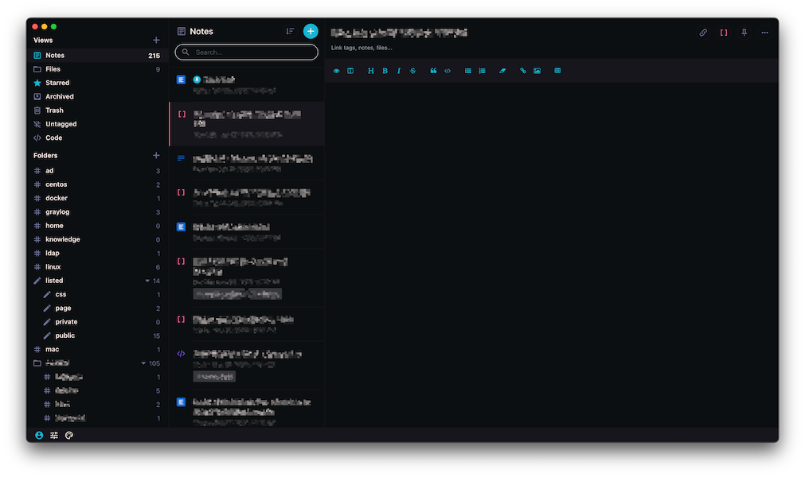
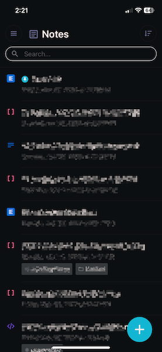

# Caerulean for Standard Notes
A dark theme with cyan highlights for [Standard Notes](https://standardnotes.org/). Originally forked from [Horizon Dark](https://github.com/luisstd/sn-theme-horizon-dark), but spun as a separate theme. Give that theme a try, it's one of the best I've personally seen for Standard Notes!

## Features
> It's a theme, why is there a features section?

* Scrollbars are hidden as they personally clash with all themes in SN.

## Screenshots
### Desktop

### Mobile

## How to Install
1. From Standard Notes, open *Preferences*
2. Click or tap on the *General* tab, then expand the **Advanced options** section at the bottom.
3. Under *Install External Plugin*, paste the following URL and click on **Install**: `https://listed.hyp5r.io/p/c2wWFzM7zR`
